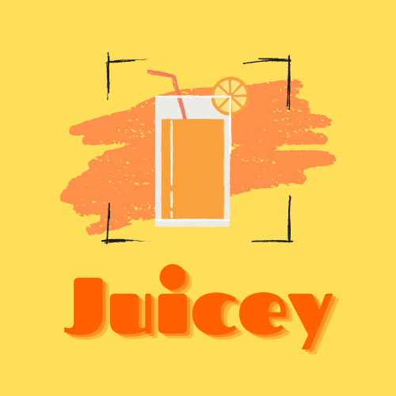
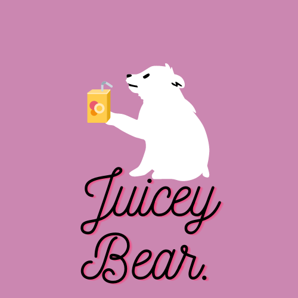

# Tedtube

# BACKEND-FRONTEND

This website uses the backend and the frontend.

# MANY THINGS

# Introducing: Icons

# Icons by Daydream-Code

https://github.com/DayDream-Code

# Icons by Compound-codes

https://github.com/Compound-codes

# How to Use

# For Mac

git clone https://github.com/Compound-codes/Juicey.git

Unzip your file. 
cd into your folder where my project is.
if you have it; nodemon app.js

or use node.

node app.js 

but, you will have to control c everytime you update.
So i advise you

npm install -g nodemon

please fork this project and ask for updates.

# My Website

https://tedtube.herokuapp.com

# Update 1.0.1

I have fixed navbar so people without font-awesome can still use the navbar.